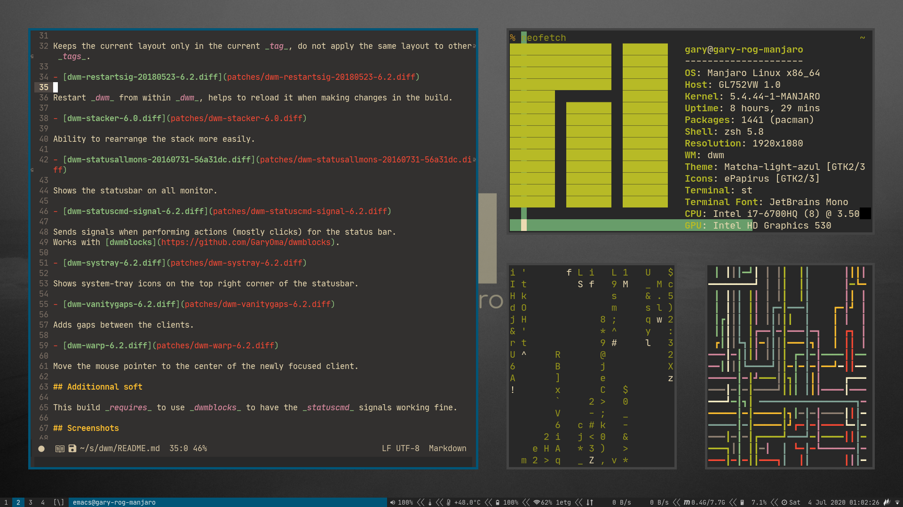
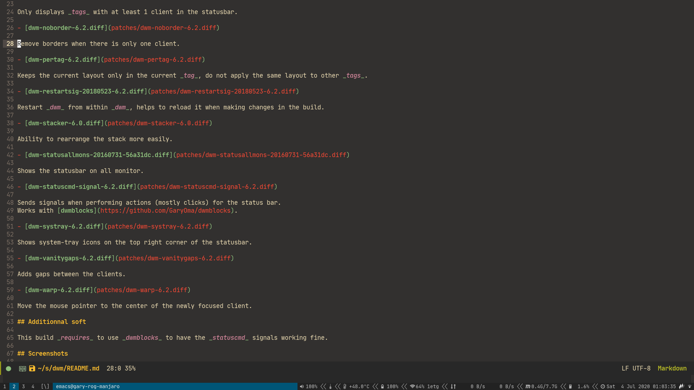
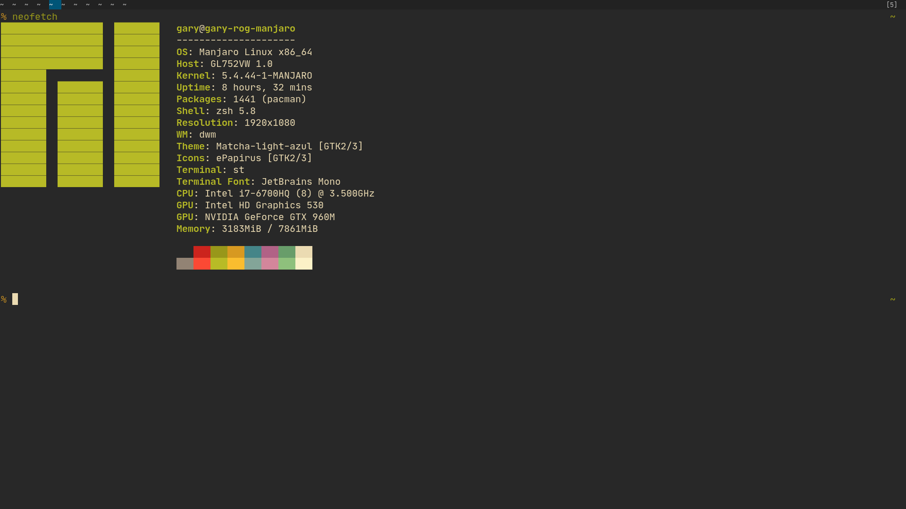

# My build of dwm

It is launched by the _gnome display manager_, using the [dwm.desktop](session/dwm.desktop) file.

This entry launches the [dwm_launcher](session/dwm_launcher.sh) script which executes _dwm_.

## Installed patches

- [dwm-6.2-tab-v2b.diff](patches/dwm-6.2-tab-v2b.diff)

Adds tabs like in i3. All client in the current _tag_ will be _tabbed_.

- [dwm-cyclelayouts-6.2.diff](patches/dwm-cyclelayouts-6.2.diff)

Cycle through all the available layouts

- [dwm-fullscreen-6.2.diff](patches/dwm-fullscreen-6.2.diff)

Fullscreenize the current client (hides the statusbar).
If there is more than one client, the clients will be _tabbed_ in fullscreen.

- [dwm-hide_vacant_tags-6.2.diff](patches/dwm-hide_vacant_tags-6.2.diff)

Only displays _tags_ with at least 1 client in the statusbar.

- [dwm-noborder-6.2.diff](patches/dwm-noborder-6.2.diff)

Remove borders when there is only one client.

- [dwm-pertag-6.2.diff](patches/dwm-pertag-6.2.diff)

Keeps the current layout only in the current _tag_, do not apply the same layout to other _tags_.

- [dwm-restartsig-20180523-6.2.diff](patches/dwm-restartsig-20180523-6.2.diff)

Restart _dwm_ from within _dwm_, helps to reload it when making changes in the build.

- [dwm-stacker-6.0.diff](patches/dwm-stacker-6.0.diff)

Ability to rearrange the stack more easily.

- [dwm-statusallmons-20160731-56a31dc.diff](patches/dwm-statusallmons-20160731-56a31dc.diff)

Shows the statusbar on all monitor.

- [dwm-statuscmd-signal-6.2.diff](patches/dwm-statuscmd-signal-6.2.diff)

Sends signals when performing actions (mostly clicks) for the status bar.
Works with [dwmblocks](https://github.com/GaryOma/dwmblocks).

- [dwm-systray-6.2.diff](patches/dwm-systray-6.2.diff)

Shows system-tray icons on the top right corner of the statusbar.

- [dwm-vanitygaps-6.2.diff](patches/dwm-vanitygaps-6.2.diff)

Adds gaps between the clients.

- [dwm-warp-6.2.diff](patches/dwm-warp-6.2.diff)

Move the mouse pointer to the center of the newly focused client.

## Additionnal soft

This build _requires_ to use _dwmblocks_ to have the _statuscmd_ signals working fine.

## Screenshots

